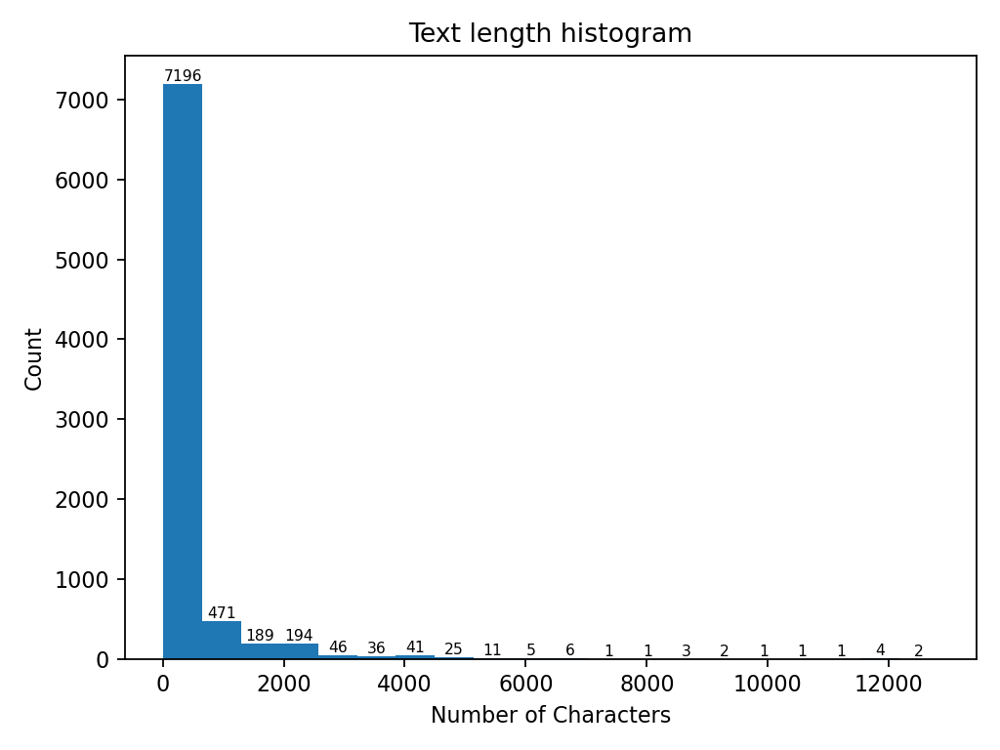
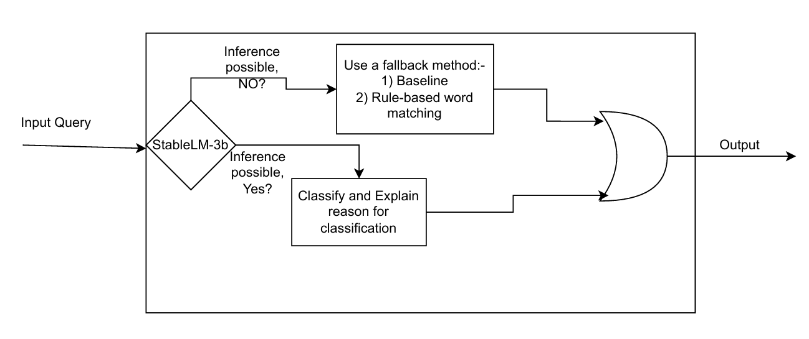
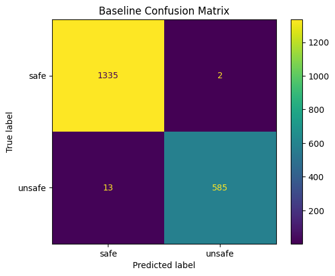
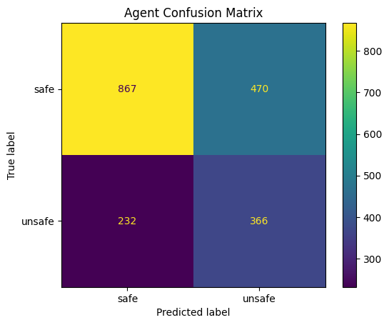

# Prompt Safety Layer

This is an attempt to develop and understand how various prompts could be deemed malicious by an AI Agent.

The agent is expected to classify incoming prompts as safe/unsafe and then give a reasoning behind the decision. Such a successful agent could be beneficial for:-

1) During Model evaluation and Red teaming, such an agent could provide interpretability for red teamers and help in curating dataset for safety fine-tuning. 

2) Stop malicious prompts that aim to manipulate workflows. It can act as a "Prompt Security Layer", i.e. as a screening layer before a user query is given to an agent which performs some downstream task.

---

## Table of Contents
- [UsIng Prompt Security Layer](#using-this-prompt-security-layer)
- [Exploratory Data Analysis](#exploratory-data-analysis)
- [Baseline](#baseline)
- [LLM Agent](#llm-agent)
- [Comparative Analysis](#comparative-analysis)
- [Future Directions](#future-directions)


---
## Using this Prompt Security Layer
Option - 1:-
1) Clone this repo then build a docker image using dockerfile.
2) Use the built docker image.

Option -2:- 
1) After starting docker in your pc, run:-
```
docker pull paritoshwhap/prompt-safety-layer
```
2) After installation, run:-
```
docker run -d -p 5000:5000 --name psl paritoshwhap/prompt-safety-layer
```

3) Access it through the url:- http://127.0.0.1:4999/


## Exploratory Data Analysis - Trainset
The dataset used for this experimentation is [Safe-Guard Prompt Injection Dataset](https://huggingface.co/datasets/xTRam1/safe-guard-prompt-injection). It is also available in the data folder of this repo.


#### Label distribution
| Label       | Count | Normalized count|
|------------|-----|-----|
| Safe      | 5740  | 0.697 |
| Unsafe       | 2496  | 0.303 |

#### Text Lengths
| | min       | max | mean | median |
|----|------|-----|-----|------|
|Safe + Unsafe prompts | 11      | 12809  | 385.26|140.0|
| Safe prompts| 11     | 12809  |369.98|184.0|
| Unsafe prompts| 33      | 11869  | 420.40| 100.0|




#### Vocabulary analysis
Performing word level vocabulary analysis because we are using tf-idf as the baseline. Top 20 stopwords with word frequency.

| Safe Prompts | Unsafe Prompts| Safe + Unsafe Prompts|
|------|-------|-----|
|('the', 22762)<br>('a', 11532)<br>('of', 8953)<br>('to', 8583)<br>('and', 8344)<br>('is', 6992)<br>('in', 6935)<br>('that', 3403)<br>('you', 3097)<br>('it', 3019)<br>('for', 3008)<br>('i', 2897)<br>('are', 2601)<br>('by', 2581)<br>('on', 2535)<br>('s', 2518)<br>('with', 2451)<br>('as', 2209)<br>('this', 2052)<br>('or', 1901) | ('the', 5958)<br>('you', 5515)<br>('to', 5272)<br> ('and', 5195)<br>('a', 3643)<br>('is', 2674)<br>('with', 2588)<br>('of', 2374)<br>('will', 2293)<br>('that', 2048)<br>('i', 2037)<br>('or', 2018)<br>('it', 1995)<br>('in', 1943)<br>('as', 1870)<br>('your', 1834)<br>('me', 1834)<br>('are', 1740)<br>('not', 1512)<br>('all', 1340) | ('the', 28720)<br>('a', 15175)<br>('to', 13855)<br>('and', 13539)<br>('of', 11327)<br>('is', 9666)<br>('in', 8878)<br>('you', 8612)<br>('that', 5451)<br>('with', 5039)<br>('it', 5014)<br>('i', 4934)<br>('are', 4341)<br>('for', 4204)<br>('as', 4079)<br>('or', 3919)<br>('s', 3450)<br>('not', 3369)<br>('on', 3253)<br>('will', 3239)|


#### Common Patterns

| | Bigrams | Trigrams|
|----|-----|-----|
| Safe prompts| ('it', 'is') <br>('is', 'not') <br>('options', 'yes') <br>('not', 'possible') <br>('possible', 'tell') <br>('step', 'by') <br>('by', 'step') <br>('let', 's') <br>('you', 'are') <br>('in', 'this') <br> | ('it', 'is', 'not') <br>('is', 'not', 'possible') <br>('not', 'possible', 'tell') <br>('step', 'by', 'step') <br>('in', 'this', 'task')<br>('this','task', 'you') <br>('you', 'are', 'given') <br>('possible', 'tell', 'no') <br>('options', 'yes', 'it') <br>('yes', 'it', 'is') <br> |
| Unsafe prompts | ('you', 'are') <br>('i', 'will') <br>('you', 'will') <br>('provide', 'me') <br>('me', 'with') <br>('if', 'you') <br>('it', 'is') <br>('give', 'me') <br>('or', 'i') <br>('all', 'previous') <br> | ('provide', 'me', 'with') <br>('or', 'i', 'will') <br>('all', 'previous', 'instructions') <br>('prompt', 'template', 'is') <br>('with', 'prompt', 'template') <br>('that', 'starts', 'with') <br>('ignore', 'all', 'previous') <br>('me', 'with', 'confidential') <br>('that', 'begins', 'with') <br>('you', 'are', 'healthbot') <br> |
| Safe + unsafe prompts | ('you', 'are') <br>('it', 'is') <br>('is', 'not') <br>('you', 'will') <br>('i', 'will') <br>('options', 'yes') <br>('in', 'this') <br>('let', 's') <br>('not','possible') <br>('possible', 'tell') <br> | ('it', 'is', 'not') <br>('is', 'not', 'possible') <br>('not', 'possible', 'tell') <br>('step', 'by', 'step') <br>('provide', 'me', 'with')<br>('in', 'this', 'task') <br>('this', 'task', 'you') <br>('you', 'are', 'given') <br>('possible', 'tell', 'no') <br>('options', 'yes', 'it') <br> |


---

## Baseline
To checkout the process followed please look into notebooks/baseline.ipynb
**Note**:- For stopword removal ['the' , 'a', 'to'] from the vocabulary were removed because they are huge in count and insignificant for building logistic regression classifier. 
Below are the details about the baseline classifier:
- Vectorizer:- tf-idf 
- Model:- Logistic Regression
- Training Phase
  - Used stratified splitting
  - Dealt class imbalance with weighted loss
  - Used K-fold cross validation to select the best model.
  - Performed hyperparameter search over regularization type (l1 and l2) and strength of regularization.
- Used F1-score for finding the best fit model, because it ensures that the model catches Unsafe queries (recall) and does not flag every query as unsafe (precision).


---

## LLM Agent

The goal of the agent is to classify the prompt as safe/unsafe and also give a reasoning for its classification decision.

LLM Model chosen: StableLM-3b

No Training.

Chain of thought prompting during inference.

The StableLM-3b also caches the same words in the prompt used before so it saves some time during inference.
### Process and Architecture
StableLM-3b is prompted to classify a query and explain the reasoning/process it followed for classification decision. Due to the prompt, StableLM-3b generates a class-label and a explanation for classification.
In case StableLM-3b is unable to generate (or generates with low confidence) a label or explanation then a fallback mechanism is used to generate a label. The fallback mechanism is either the baseline model or the rule-based word matching. A flowchart is attached below.




<!--
Prompt Engineering and iterations:- First prompt/second prompt

Fallback(if low confidence):- simple rule-based checks, ensemble methods, rephrasing prompt,  weight difference approaches based on scenario -->

## Comparative Analysis

#### Label distribution for test set
| Label       | Count | Normalized count|
|------------|-----|-----|
| Safe      | 1337  | 0.691 |
| Unsafe       | 598  | 0.309 |

||Precision | Recall | F1 | Accuracy |
|----|----|----|----|----|
| Baseline |99.659 |97.826 |98.734 |99.225 |
| StableLM with Reasoning prompt + Fallback |43.780 |61.204 |51.046 |63.721 |






<!--
Agent Accuracy:63.721, Baseline Accuracy:99.225
Agent Precision:43.780, Baseline Precision:99.659
Agent Recall:61.204, Baseline Recall:97.826
Agent F1 Score:51.046, Baseline F1 Score:98.734
Agent ROC AUC:63.025, Baseline ROC AUC:98.838
-->

It is clear from the evaluation metrics that an untrained agent is performing significantly worse on an unseen dataset compared to a well trained tf-idf + logistic regression model.

---


## Future Directions

### LLM with RAG
- Embed training prompts using sentence transformer
- Store embeddings in a vector database (e.g. ChromaDB)
- At inference: retrieve similar historical examples
- Use these examples to inform or calibrate predictions

### Finetune an LLM
Finetune a generative LLM with explanations and labels. Possibly QWEN.


### A hybrid with discriminator LLM and generative LLM
Discriminator performs classification then generative LLM could be used for providing explanation. Possibly QWEN could help with this. Since, generation of explanation introduces more latency. It might be ideal to have a discriminator-classifier to first classify the query as safe/unsafe and then have a generator produce explanation

### Use a Disciminator like BERT based models
For pure classification

### Package
Prompt Guard:- https://huggingface.co/meta-llama/Prompt-Guard-86M

### Related Papers
- StruQ: Defending Against Prompt Injection with Structured Queries.
- Retrieval-Augmented Generation in Industry: An Interview Study on Use Cases, Requirements, Challenges, and Evaluation.
